# Common Visitor Questions for Serviced Office and Coworking Websites

## Executive Summary

Across major flexible-workspace operators, the same visitor questions recur with striking consistency: location, pricing, plans, day passes, meeting rooms, virtual offices, booking, contract flexibility, IT/security, accessibility, and legal/compliance. Official WeWork, Regus, Spaces, Servcorp and IWG pages all foreground these themes, while Google-Trends-based coworking research shows that broad coworking demand is relatively stable, “virtual office” maintains unusually strong niche interest, and local-intent queries remain commercially important. citeturn14view0turn18view0turn27view0turn12view0turn19view1turn10view0turn30view0

For AI-training purposes, the highest-value question set is not just “what is coworking?” but “How much does it cost?”, “Is there a space near me?”, “Do you offer day passes?”, “Can I book a meeting room by the hour?”, “What’s included?”, and “Can I use a virtual office for company registration?”. That ordering is supported by operator FAQ prominence, Google-search-oriented coworking SEO guidance, “near me” local-search behaviour, and Google Trends evidence that users often move quickly from discovery to transactional checks. citeturn18view0turn14view1turn25view0turn29view0turn30view0turn10view0

The practical implication is that a strong website assistant for a serviced office or coworking operator should prioritise four jobs. It should first resolve local commercial intent fast: nearest centre, opening/access hours, product types, and entry price. It should then answer plan-fit questions clearly: hot desk versus dedicated desk, day pass versus monthly membership, meeting-room by-the-hour, and virtual-office scope. Third, it should de-risk the purchase: contract term, cancellation, deposits, billing, Wi‑Fi/security, accessibility, and legal limits for company registration. Finally, it should support larger accounts with enterprise, partner-network and custom-space answers. citeturn14view0turn11view3turn22view0turn22view2turn12view4turn14view2turn19view0turn19view1

A country-neutral English dataset should therefore avoid hard-coding jurisdiction-sensitive claims. Registration rules, tax treatment, notice periods, building access, accessibility features, CCTV retention, and health policies vary by country, building and plan, so the safest training pattern is: answer the common intent directly, state the usual default, and then localise with live building or jurisdiction data when needed. That approach is consistent with operator disclosures on company registration, agreement structure, privacy/CCTV, and building-level accessibility. citeturn22view0turn22view2turn25view0turn26view0turn26view1

## Research Basis and Ranking Method

This report uses a blended prioritisation model rather than raw monthly keyword volumes. Google Trends itself uses relative search interest rather than absolute counts, with 100 representing the peak within a chosen timeframe; CoworkingCafe’s Google-Trends-based coworking study applies that same logic and found “coworking” and “virtual office” to be high-interest terms, with “shared office space” materially lower and “private office space” more niche. citeturn28view0turn10view0

The question inventory was built from three evidence layers. First, primary operator pages: WeWork, Regus, Spaces, Servcorp, Industrious and IWG repeatedly surface Q&As on cost, memberships, accessibility, day passes, meeting rooms, virtual offices, company registration, support teams, and enterprise solutions. Second, search-behaviour sources: coworking SEO guidance highlights Google suggested queries, related searches, location modifiers, and “near me” intent as important demand signals. Third, industry pricing reports: CoworkingCafe’s 2026 UK/Ireland and U.S. reporting shows that users are comparing day passes, memberships, meeting rooms and virtual offices as distinct product lines, not as a single “workspace” bucket. citeturn14view0turn18view0turn27view0turn12view0turn11view4turn19view1turn29view0turn30view0turn23view1turn23view2turn23view5

The top-50 ranking below is therefore an **estimated relative search-interest index** for visitor-facing website questions, normalised to 100 within this study. It combines search-intent strength, transactional closeness, prominence on official operator pages, and broader trend evidence. This is more reliable than inventing exact keyword volumes: Ahrefs explicitly notes that AI systems without a live keyword database cannot produce trustworthy volume or SERP figures, so relative scoring is the safer analytical choice here. citeturn31view1turn31view0

Because no country was specified, the answer set below is written in English (en‑GB) and intentionally operator-neutral. Jurisdiction-specific items are phrased with safe qualifiers such as “usually”, “often”, or “subject to local law”, matching how operators themselves present business-registration, agreement and policy disclosures. citeturn22view0turn22view2turn25view0turn26view0

## Intent Map

The evidence clusters into a fairly stable visitor-intent tree: local discovery, pricing and fit, product understanding, purchase-risk reduction, and enterprise expansion. Official site IA from WeWork, Regus, Spaces and IWG maps to exactly those branches. citeturn19view0turn19view1turn27view0turn18view0

```mermaid
flowchart TD
    A[Visitor intent]

    A --> B[Find a place]
    B --> B1[Near me]
    B --> B2[Locations]
    B --> B3[Availability and access]

    A --> C[Understand cost]
    C --> C1[Pricing]
    C --> C2[Plans]
    C --> C3[Value versus traditional office]

    A --> D[Check the product]
    D --> D1[Hot desk or dedicated desk]
    D --> D2[Meeting rooms]
    D --> D3[Virtual office]
    D --> D4[Private office and day use]

    A --> E[De-risk the decision]
    E --> E1[Booking and tours]
    E --> E2[Contracts and billing]
    E --> E3[Security and IT]
    E --> E4[Accessibility and health]
    E --> E5[Legal and compliance]

    A --> F[Grow with the operator]
    F --> F1[Community and support]
    F --> F2[Enterprise solutions]
    F --> F3[Partnerships]
    F --> F4[Sustainability]
```



## Top Questions by Relative Search Interest

The table below is a prioritised training list. Scores are **estimated relative search interest**, not absolute monthly searches. They are inferred from Google Trends-style relative interest, official operator FAQ placement, local-search behaviour, and pricing/reporting coverage across the sector. citeturn10view0turn30view0turn18view0turn14view0turn23view1turn23view5

| ID | Question | Category | Estimated relative search interest |
|---|---|---|---:|
| Q01 | Is there a coworking space near me? | Location | 100 |
| Q02 | How much does coworking cost? | Pricing | 98 |
| Q03 | What membership plans do you offer? | Membership | 96 |
| Q04 | Do you offer day passes? | Membership | 94 |
| Q05 | Can I book a meeting room by the hour? | Meeting rooms | 92 |
| Q06 | What is included in the price? | Pricing | 90 |
| Q07 | Which locations do you have? | Location | 88 |
| Q08 | What is the difference between a hot desk and a dedicated desk? | Membership | 87 |
| Q09 | What amenities are included? | Facilities | 86 |
| Q10 | What is a virtual office or business address? | Virtual office | 84 |
| Q11 | Can I use a virtual office for company registration? | Virtual office | 83 |
| Q12 | How do I book a desk, office or room? | Booking | 82 |
| Q13 | Can I tour the space before I join? | Booking | 80 |
| Q14 | How much does a meeting room cost? | Meeting rooms | 78 |
| Q15 | Do you offer monthly memberships? | Membership | 76 |
| Q16 | Do I need to book in advance? | Booking | 75 |
| Q17 | Do you have 24/7 access? | Access | 73 |
| Q18 | Is the Wi‑Fi fast and secure? | IT/connectivity | 72 |
| Q19 | Are utilities, cleaning and maintenance included? | Billing | 70 |
| Q20 | Is coworking cheaper than a traditional office? | Pricing | 69 |
| Q21 | What is your cancellation policy? | Cancellation | 67 |
| Q22 | What contract terms do you offer? | Contracts | 66 |
| Q23 | Can I scale my plan up or down? | Membership | 65 |
| Q24 | Can freelancers, start-ups and larger teams all use the space? | Audience fit | 64 |
| Q25 | What meeting room equipment is included? | Meeting rooms | 63 |
| Q26 | Can you help with events, board meetings or training sessions? | Meeting rooms | 62 |
| Q27 | What is included in a virtual office plan? | Virtual office | 61 |
| Q28 | Can I access meeting rooms or coworking with a virtual office? | Virtual office | 60 |
| Q29 | How does billing work? | Billing | 59 |
| Q30 | Is there a deposit? | Billing | 58 |
| Q31 | Do you have parking, bike storage or showers? | Facilities | 56 |
| Q32 | Are phone booths and quiet areas available? | Facilities | 55 |
| Q33 | Is the building accessible for disabled visitors? | Accessibility | 54 |
| Q34 | Do you run community events? | Community | 53 |
| Q35 | Do you offer hard-wired internet or private networks? | IT/connectivity | 52 |
| Q36 | How do you handle building security and access control? | Security | 50 |
| Q37 | Do you use CCTV and how is my data handled? | Privacy | 49 |
| Q38 | Do you support hybrid teams and flexible work patterns? | Hybrid work | 48 |
| Q39 | What are your general health and safety rules? | Health & safety | 46 |
| Q40 | Can I receive mail and packages? | Virtual office | 45 |
| Q41 | Do you still have COVID-specific policies? | COVID/health | 44 |
| Q42 | Do you have wellness features or parent rooms? | Wellbeing | 43 |
| Q43 | Do you help with company registration or compliance checks? | Legal/compliance | 42 |
| Q44 | What sustainability features do you offer? | Sustainability | 40 |
| Q45 | Do you work with brokers, landlords or referral partners? | Partnerships | 39 |
| Q46 | Do you offer enterprise solutions for multi-site teams? | Enterprise | 38 |
| Q47 | Can you customise space for my team or industry? | Enterprise | 37 |
| Q48 | Do you have partner locations outside your own network? | Enterprise | 36 |
| Q49 | Are your agreements leases or service agreements? | Legal/compliance | 35 |
| Q50 | Is on-site support available? | Support | 34 |

**Reference price context for training notes.** Recent market reporting suggests that, as of Q1 2026, typical medians are roughly **£25 day pass / £180 monthly membership / £30 meeting room hour / £115 virtual office month** in the UK, and roughly **$33 day pass / $220 monthly membership / $45 meeting room hour / $169 virtual office month** in the U.S. These figures are useful for comparative training logic, but a production chatbot should always return live local pricing rather than generic medians. citeturn23view1turn23view5turn23view2

## Categorised Q&A Pairs

The answer pairs below are intentionally written as **operator-neutral training data**. Replace live fields such as location, price, access hours, notice period, and legal eligibility with current centre-specific data before deployment. The groupings mirror the most common operator FAQ structures and search-intent patterns. citeturn14view0turn18view0turn27view0turn25view0

### Discovery and commercial fit

Official site content repeatedly emphasises cost, product types, day access, amenities, and local availability. Regus explicitly foregrounds “How much does coworking cost?”, WeWork surfaces plan and accessibility Q&As on location pages, and search-behaviour sources highlight Google suggested queries and local modifiers as crucial for qualified traffic. citeturn18view0turn14view0turn29view0turn30view0

| ID | Question | Short answer | Expanded answer | Metadata |
|---|---|---|---|---|
| Q01 | Is there a coworking space near me? | Probably yes if you operate in the user’s city or nearby business districts. Offer the nearest centre, travel cues and available products immediately. | The best response is location-first: show the nearest centre or shortlist nearby centres, then add opening/access hours and whether the site offers coworking, private offices, meeting rooms or virtual-office services. If the operator has multiple centres, offer a comparison by commute, neighbourhood and product fit. If no live location is available, ask for area, postcode or city before continuing. | Intent: `location.near_me` • Variants: “coworking near me”, “shared office close by” • Tone: practical, fast, local • Confidence: 0.95 |
| Q02 | How much does coworking cost? | Pricing varies by location, product and commitment length. Give a starting price if live data exists; otherwise explain the main price drivers. | A safe generic answer is that prices depend on city, building, access type, and whether the user wants a day pass, monthly membership, dedicated desk or private office. Meeting rooms and virtual offices are usually priced separately, and longer terms often improve the rate. If you cannot show live prices, explain the structure clearly and guide the user to a quote or matching options. | Intent: `pricing.cost` • Variants: “coworking prices”, “what does a desk cost?” • Tone: transparent, commercially neutral • Confidence: 0.93 |
| Q03 | What membership plans do you offer? | Typical options include day passes, hot desks, dedicated desks, private offices, meeting rooms and virtual-office products. Some operators also offer multi-site or enterprise plans. | The user normally wants a quick menu, not a brochure. State the plan families first, then describe who each plan suits best: occasional users, regular individuals, small teams, growing teams, or distributed enterprises. End with a simple recommendation path, such as “day pass for ad-hoc use, monthly hot desk for flexibility, dedicated desk for consistency, private office for teams”. | Intent: `plan.options` • Variants: “plans available”, “membership options” • Tone: structured, helpful • Confidence: 0.94 |
| Q04 | Do you offer day passes? | Many operators do offer day passes or on-demand workspace. Availability usually depends on the building and date. | A good training answer should confirm that day access is common, explain that usage may be limited to business or staffed hours, and note that the same operator may not offer day passes in every building. If the inventory is live, show the closest available sites and entry price. If not, direct the user to the booking path or ask for location and date. | Intent: `plan.day_pass` • Variants: “book a desk for a day”, “one-day coworking” • Tone: quick, transactional • Confidence: 0.93 |
| Q06 | What is included in the price? | Core inclusions usually cover workspace, Wi‑Fi, common areas, cleaning and on-site support. Some plans also include meeting-room credits, printing, mail handling or community access. | This is one of the most important trust-building questions, so the answer should separate **included** items from **extra-charge** items. Explain the baseline bundle first, then list common paid add-ons such as meeting-room overages, specialist IT, mail forwarding, storage, extra guests or catering. If the plan is location-specific, say that exact inclusions are confirmed at checkout or in the quote. | Intent: `pricing.inclusions` • Variants: “what’s included?”, “are there hidden fees?” • Tone: reassuring, precise • Confidence: 0.91 |
| Q07 | Which locations do you have? | Most operators list centres by city, district and workspace type. The ideal answer gives a filtered shortlist, not just a link. | Users asking this are often choosing between commute, prestige and budget. Return the relevant centres first, then add distinguishing cues such as CBD versus neighbourhood, near transport, opening hours, and which products are available at each site. If the operator has a large network, offer filtering by city, postcode, country or product. | Intent: `location.directory` • Variants: “your locations”, “where are your offices?” • Tone: organised, discovery-led • Confidence: 0.95 |
| Q08 | What is the difference between a hot desk and a dedicated desk? | A hot desk is any available seat in a shared area; a dedicated desk is a reserved desk for one user. Dedicated desks usually offer more consistency and often longer access hours. | This answer should be simple because it is a classic conversion blocker. Explain that hot desking is best for flexibility and occasional or mobile work, while a dedicated desk suits someone who wants the same workstation each time and may need storage or 24/7-style access. If both products exist, finish by recommending which one suits the user’s working rhythm. | Intent: `plan.hotdesk_vs_dedicated` • Variants: “hot desk vs dedicated desk”, “assigned desk or shared desk?” • Tone: clear, explanatory • Confidence: 0.95 |
| Q09 | What amenities are included? | Common amenities often include fast internet, lounges, pantry or kitchen space, meeting rooms, phone booths, printing and on-site staff. Premium buildings may add showers, bike storage, cafés, gyms or parent rooms. | The best answer groups amenities into categories: work essentials, meeting/call spaces, comfort features, and extras unique to the building. Avoid implying that every building has every feature; instead say which amenities are standard across most centres and which are building-specific. If live building pages exist, list only verified amenities for the chosen location. | Intent: `amenities.general` • Variants: “facilities included”, “what do I get on site?” • Tone: informative, specific • Confidence: 0.90 |
| Q15 | Do you offer monthly memberships? | Yes, monthly memberships are common across coworking and flexible-office products. Some operators also offer longer discounted terms. | Users asking this usually want a middle ground between ad-hoc booking and a full office commitment. Explain that monthly products are common for hot desk access, dedicated desks, private offices and some virtual-office services. If relevant, mention that annual or six-month commitments can improve pricing, while month-to-month keeps flexibility higher. | Intent: `plan.monthly` • Variants: “monthly plan”, “pay month by month?” • Tone: straightforward • Confidence: 0.93 |
| Q17 | Do you have 24/7 access? | It depends on the product and building. Dedicated desks and private offices are more likely to include extended or 24/7 access than day passes. | This answer works best when it distinguishes **staffed hours** from **member access hours**. Clarify that some products only allow access during business hours, while reserved desks or private offices may include round-the-clock access. If building-level data is unavailable, say so plainly rather than assuming universal 24/7 access. | Intent: `access.hours` • Variants: “open all night?”, “can I work after hours?” • Tone: precise, expectation-setting • Confidence: 0.84 |
| Q19 | Are utilities, cleaning and maintenance included? | In serviced workspace, those items are usually bundled into the standard fee. Specialist services may still sit outside the base price. | This is a classic serviced-office question and should be answered directly. State that utilities, cleaning and routine maintenance are generally included, which is part of the appeal versus a traditional lease. Then note that exceptional IT work, premium meeting-room usage, custom fit-outs or other extras may still be charged separately. | Intent: `billing.all_inclusive` • Variants: “are bills included?”, “do I pay for utilities?” • Tone: concise, reassuring • Confidence: 0.94 |
| Q20 | Is coworking cheaper than a traditional office? | Often yes for small or flexible teams, because fit-out, furniture, utilities and operations are bundled. For very stable larger teams, the economics can vary. | A strong answer should frame coworking as a flexibility product rather than a universal cheapest option. It is often more cost-efficient when a team wants short commitments, move-in readiness, minimal capital spend and the ability to scale. But if the team is large, highly stable and committed long term, the per-desk cost comparison may change, so the right answer depends on usage pattern rather than headline rent alone. | Intent: `pricing.value_compare` • Variants: “better than leasing?”, “cheaper than an office lease?” • Tone: balanced, advisory • Confidence: 0.88 |
| Q24 | Can freelancers, start-ups and larger teams all use the space? | Yes. Flexible workspace products are usually designed for individuals, small teams and larger distributed organisations. | The simplest high-quality answer is “yes, but the best product differs by need”. Explain which products typically suit freelancers, early-stage teams, project groups and larger enterprises. If the operator offers enterprise or portfolio solutions, mention them briefly so the chatbot does not sound SME-only. | Intent: `audience.fit` • Variants: “is this just for freelancers?”, “can big teams use it too?” • Tone: inclusive, confidence-building • Confidence: 0.93 |

### Booking and workspace products

Meeting rooms, virtual offices and tours are not fringe questions; they are core conversion paths. WeWork, Regus and Spaces all expose these products prominently, with book-by-hour meeting space, business-address services, tours, app-based booking, and virtual-office access options appearing directly in official visitor-facing pages. citeturn11view2turn11view3turn22view0turn22view2turn27view1turn25view0

| ID | Question | Short answer | Expanded answer | Metadata |
|---|---|---|---|---|
| Q05 | Can I book a meeting room by the hour? | Yes, hourly meeting-room booking is a standard product for many operators. Room size, layout and included equipment vary by site. | A well-trained chatbot should confirm hourly booking first, then ask whether the user needs a small interview room, boardroom, classroom or event-style layout. It should also mention that availability and minimum booking windows can vary by location. If live inventory exists, the next step should be date, time, headcount and required AV. | Intent: `meeting.hourly_booking` • Variants: “meeting room for one hour”, “hourly boardroom hire” • Tone: action-oriented • Confidence: 0.95 |
| Q10 | What is a virtual office or business address? | A virtual office gives a business a professional address and related admin services without leasing full-time workspace. It often includes mail handling and may include phone or receptionist services. | The answer should stress that this is an **address-and-services** product, not simply a mailbox. Many users ask because they want credibility, privacy, a trading address, or client-facing materials without a physical desk commitment. The response should also clarify that workspace access may be bundled, optional or absent depending on the plan. | Intent: `virtual_office.definition` • Variants: “business address service”, “how does a virtual office work?” • Tone: clear, confidence-building • Confidence: 0.94 |
| Q11 | Can I use a virtual office for company registration? | Sometimes, but the rule is local-law dependent. The chatbot should explain the general possibility and immediately caveat that jurisdiction, product terms and service-of-process rules vary. | This is one of the most important places **not** to overstate. Explain that some operators allow company registration or registered-office use, while others restrict it, and that local corporate law decides what is valid. The right next step is to direct the user to the local compliance note or a specialist team, not to pretend the answer is universal. | Intent: `virtual_office.registration` • Variants: “can I register my company there?”, “can I use this address for incorporation?” • Tone: careful, compliance-aware • Confidence: 0.72 |
| Q12 | How do I book a desk, office or room? | Booking is usually handled online, in-app or through a sales team. The user typically needs to choose location, date, product and any extras. | A good training answer walks the user through the shortest path: pick a centre, select the product type, choose the date or term, then add any extras such as AV, catering or mail services. If the booking flow is long, the chatbot should offer help narrowing the choice first. For high-intent users, the answer should finish with a clear CTA instead of more explanation. | Intent: `booking.how_to` • Variants: “how do I reserve?”, “book a desk online?” • Tone: direct, operational • Confidence: 0.94 |
| Q13 | Can I tour the space before I join? | Yes, tours are commonly offered and are usually the best way to validate fit. A good chatbot should encourage a tour for users comparing layout, noise level or amenities. | Tour requests are high-intent. The answer should explain that tours let the user inspect access, meeting areas, call spaces, neighbourhood feel and actual building condition. The next step should be scheduling, not a generic sales paragraph. | Intent: `tour.request` • Variants: “book a tour”, “see the office first?” • Tone: welcoming, action-led • Confidence: 0.95 |
| Q14 | How much does a meeting room cost? | Price depends on location, room size, duration and extras such as catering or hybrid AV. Give an entry rate or local quote if available. | A robust answer should say that meeting-room pricing is its own product line and can differ materially from desk pricing. Explain the main drivers clearly, then mention that half-day or full-day discounts may apply at some operators. If live prices are unavailable, do not guess; offer a quote path or nearest-location estimate logic. | Intent: `meeting.pricing` • Variants: “meeting room rate”, “how much to hire a boardroom?” • Tone: transparent, transactional • Confidence: 0.91 |
| Q16 | Do I need to book in advance? | It is recommended for busy times and usually necessary for meeting rooms or customised setups. Dedicated desks and private offices often do not require daily rebooking. | The user is usually asking about risk of showing up and not finding space. Explain that hot desks may book out, especially at peak periods, while meeting rooms, events and special layouts should normally be reserved in advance. Then offer the simplest next step: check live availability or hold a slot. | Intent: `booking.advance` • Variants: “can I just turn up?”, “do I need a reservation?” • Tone: practical, expectation-setting • Confidence: 0.92 |
| Q18 | Is the Wi‑Fi fast and secure? | Most operators provide business-grade internet, but performance and security tiers differ by building and plan. If available, mention guest Wi‑Fi, secure logins and upgrade options. | This is both an amenities and trust question, so the answer should avoid vague marketing language. Confirm that high-speed Wi‑Fi is standard, then explain whether the operator also offers secure networks, guest access, Ethernet or optional enhanced services. For privacy-sensitive buyers, be ready to route them to a more technical answer. | Intent: `it.wifi` • Variants: “internet speed”, “secure Wi‑Fi?” • Tone: reassuring, factual • Confidence: 0.89 |
| Q25 | What meeting room equipment is included? | Typical equipment includes a screen or TV, whiteboard, video-conferencing capability and front-of-house support. Exact AV depends on the room. | A high-quality answer should separate **standard in-room equipment** from **bookable extras**. For example, displays and whiteboards may be standard, while specialist hybrid AV, microphones, technicians or catering can be additional. End by asking what kind of meeting the user is hosting so the setup can be matched properly. | Intent: `meeting.amenities` • Variants: “AV included?”, “does the room have video conferencing?” • Tone: specific, consultative • Confidence: 0.90 |
| Q26 | Can you help with events, board meetings or training sessions? | Usually yes. Many operators can support layout changes, guest handling, refreshments and AV for formal or group events. | This answer should reassure the user that events are not limited to simple room hire. Mention common support elements such as boardroom layouts, classroom seating, delegate reception, signage, catering or vendor coordination. The next step is to collect headcount, format, timing and whether the event is internal, client-facing or public. | Intent: `meeting.events` • Variants: “host a workshop”, “training room setup” • Tone: capable, service-led • Confidence: 0.90 |
| Q27 | What is included in a virtual office plan? | The base plan usually includes a business address and mail handling. Higher-tier plans may add phone answering, receptionist support, meeting-room credits or workspace access. | The strongest answer is bundle-based: start with the basic plan, then explain what upgrades add. This helps the user compare “address only” versus “operational support” plans. Because virtual-office bundles vary widely, the chatbot should avoid implying that every operator includes call answering or workspace days by default. | Intent: `virtual_office.inclusions` • Variants: “virtual office features”, “what comes with a business address?” • Tone: structured, clear • Confidence: 0.91 |
| Q28 | Can I access meeting rooms or coworking with a virtual office? | Often yes, either as pay-as-you-go access or as part of a higher-tier virtual-office plan. The entitlement depends on the product. | This is a common upsell question, so the answer should be direct and non-pushy. Explain that some plans include a set amount of workspace access or meeting-room benefits, while others rely on member-rate or on-demand booking. If the plan is ambiguous, the chatbot should invite the user to compare virtual-office tiers. | Intent: `virtual_office.workspace_access` • Variants: “does a virtual office include desk access?”, “can I still book rooms?” • Tone: helpful, precise • Confidence: 0.88 |
| Q40 | Can I receive mail and packages? | Usually yes for virtual-office plans and many private offices. For other products, it may be limited or available as an add-on. | The answer should distinguish between **mail handling**, **package handling** and **mail forwarding**, because users often mean different things. State the usual default by product type, then clarify if forwarding, scanning or collection windows create extra charges. This is especially important for remote firms and founders protecting their home address. | Intent: `virtual_office.mail` • Variants: “mail handling”, “can parcels be sent there?” • Tone: operational, reassuring • Confidence: 0.89 |

### Policies, security and operations

Serviced-workspace buyers ask recurring “risk reduction” questions around contracts, deposits, notices, security, privacy and legal structure. Servcorp is unusually explicit on contract length, deposits and notice periods; Regus and Spaces explicitly state that their agreements are not leases; WeWork and Servcorp both describe network/security features; IWG explains CCTV and privacy handling in formal policy language. citeturn12view0turn12view4turn12view5turn25view0turn27view0turn14view2turn26view0

| ID | Question | Short answer | Expanded answer | Metadata |
|---|---|---|---|---|
| Q21 | What is your cancellation policy? | Cancellation depends on the product and term. Flexible plans usually need notice; fixed terms may have stricter rules. | This answer should never sound more flexible than the contract really is. Explain that notice periods vary by plan type and that fixed-term products may only cancel at or near the agreed end date. If the precise policy is unavailable, say that the notice period will be confirmed in the quote or membership agreement. | Intent: `contract.cancellation` • Variants: “how do I cancel?”, “notice period?” • Tone: calm, exact • Confidence: 0.84 |
| Q22 | What contract terms do you offer? | Most operators offer a range from hourly or daily use to monthly and longer fixed terms. Longer commitments usually improve pricing. | The answer should help the user choose the shortest viable commitment for their need. Explain that ad-hoc products suit occasional use, monthly plans suit ongoing flexibility, and longer terms can reduce cost for teams needing stability. If enterprise or custom deals exist, mention them as a separate path. | Intent: `contract.term` • Variants: “minimum term”, “how long is the contract?” • Tone: advisory • Confidence: 0.91 |
| Q23 | Can I scale my plan up or down? | Usually yes, subject to product availability. That flexibility is one of the main reasons teams choose flexible workspace. | A good answer links scaling to real use cases: adding desks, moving from shared space to a private office, shortening or expanding access, or using multiple sites. Be careful not to imply instant availability everywhere; some moves depend on building stock. If availability is tight, say so. | Intent: `plan.scale` • Variants: “upgrade later?”, “reduce desks if needed?” • Tone: confident, realistic • Confidence: 0.90 |
| Q29 | How does billing work? | Memberships are commonly billed monthly, with add-ons and overages charged separately. Taxes, proration and billing dates may vary. | The answer should describe the billing structure in plain English: recurring subscription for the base product, then separate charges for extras if relevant. Explain that meeting rooms, guests, printing, IT upgrades or forwarding services may sit outside the main fee. If the operator offers invoicing, auto-pay or app billing, state that clearly. | Intent: `billing.process` • Variants: “how am I charged?”, “monthly invoice or card?” • Tone: transparent, administrative • Confidence: 0.89 |
| Q30 | Is there a deposit? | Sometimes, but not always. Some providers waive deposits for certain payment methods or lower-risk products. | This answer should not assume that every product behaves like every other. Explain that virtual-office and lighter-touch products may have lower or no deposit requirements, while private offices or customised space may still require one. If you have a live rule by product, return that rather than general wording. | Intent: `billing.deposit` • Variants: “security deposit?”, “upfront payment?” • Tone: concise, factual • Confidence: 0.82 |
| Q31 | Do you have parking, bike storage or showers? | Some buildings do, some do not. Always answer this from the selected centre rather than from the brand level. | These amenities are highly building-specific and influence conversion for commuters. The safest answer is to verify the exact site and then list only confirmed transport and wellness features. If the user has not named a location yet, ask for it before asserting that an amenity exists. | Intent: `amenities.transport` • Variants: “parking available?”, “bike storage and showers?” • Tone: building-specific, practical • Confidence: 0.78 |
| Q32 | Are phone booths and quiet areas available? | Many coworking sites do offer phone booths or quiet nooks, but supply depends on layout and demand. | The best answer explains both availability and limits. Confirm that most premium operators provide spaces for short calls and focused work, but be honest that peak-use times can affect immediate access in shared environments. If the user has heavy call volume, recommend a dedicated desk, private office or bookable room where appropriate. | Intent: `amenities.phonebooths` • Variants: “private call booths?”, “quiet work areas?” • Tone: realistic, helpful • Confidence: 0.86 |
| Q35 | Do you offer hard-wired internet or private networks? | Some operators do offer Ethernet, private networks, VLAN-style options or dedicated IT packages. These are commonly treated as add-on services. | Security-sensitive buyers often ask this after the basic Wi‑Fi question. Answer by confirming whether the operator provides business-grade upgrades such as Ethernet, secure Wi‑Fi tiers, guest-network separation, private server rooms or managed IT support. If the site is not enterprise-ready, avoid bluffing. | Intent: `it.private_network` • Variants: “Ethernet available?”, “private network for my team?” • Tone: technical, credible • Confidence: 0.83 |
| Q36 | How do you handle building security and access control? | Security usually combines staffed reception, controlled entry and visitor management. Some sites also use card, app or code access and CCTV. | This answer should reassure without oversharing operational detail. Explain the visible layers first: reception, check-in, access controls and guest handling. Then mention that exact measures vary by building and product, which is especially important for 24/7-access plans and regulated teams. | Intent: `security.access` • Variants: “building security”, “who can enter the office?” • Tone: reassuring, measured • Confidence: 0.86 |
| Q37 | Do you use CCTV and how is my data handled? | Some centres do use CCTV for safety and security, and privacy policies explain how that data is handled. Data rights and retention vary by law. | Because this is a privacy question, the assistant should be precise and calm. State whether CCTV may be used, why it is used, and that privacy notices explain collection, storage, security and user rights. Avoid giving legal advice; direct users to the privacy policy or privacy contact for formal data-access requests. | Intent: `privacy.cctv` • Variants: “do you have cameras?”, “how do you store CCTV data?” • Tone: privacy-aware, formal • Confidence: 0.77 |
| Q39 | What are your general health and safety rules? | Expect standard workplace rules around emergency procedures, safe use of shared areas, cleanliness and respectful conduct. Some event or catering setups may have extra rules. | A strong answer should sound like a workplace operator, not a generic HR manual. Mention the practical points users care about: emergency exits, meeting-room behaviour, food and drink rules if relevant, safe use of shared amenities, and following staff instructions. If the building has special requirements, site-specific notices should override the generic answer. | Intent: `health.safety_rules` • Variants: “health and safety policy”, “building rules?” • Tone: calm, operational • Confidence: 0.84 |
| Q41 | Do you still have COVID-specific policies? | Some operators still maintain location-specific infectious-disease guidance, but many now fold this into broader health-and-safety policies. Local public-health rules and building notices should always take priority. | The safest training answer is deliberately current-neutral. Explain that screening, distancing or other controls may change by location and public guidance, so the only definitive answer is the current centre policy. If the operator has no separate COVID page, redirect the user to the health-and-safety or building-updates section. | Intent: `health.covid` • Variants: “COVID rules still in place?”, “mask or screening rules?” • Tone: careful, up to date • Confidence: 0.68 |
| Q43 | Do you help with company registration or compliance checks? | Operators can often explain whether a product supports registration, but they usually do not replace legal advice. Users should still verify local requirements. | This answer should distinguish **commercial guidance** from **legal advice**. It is reasonable for an operator to explain whether a business-address product may be used for company registration and what documents may be required, but compliance eligibility remains jurisdiction-dependent. When in doubt, route the user to a compliance or local specialist contact. | Intent: `compliance.registration_support` • Variants: “help with incorporation?”, “do you check compliance documents?” • Tone: cautious, practical • Confidence: 0.74 |
| Q44 | What sustainability features do you offer? | Sustainability signals may include green-building certifications, efficient building design, renewable-electricity goals or waste-reduction programmes. Site-specific proof is stronger than general claims. | The best answer combines corporate ESG commitments with building-level features. Mention items such as green certifications, energy efficiency, renewable targets, water or waste goals, and then add any location-specific sustainability features the user can verify. Avoid vague “eco-friendly” wording unless the operator has explicit evidence. | Intent: `sustainability.features` • Variants: “green building?”, “environmental credentials?” • Tone: factual, non-hyped • Confidence: 0.80 |
| Q49 | Are your agreements leases or service agreements? | For many flexible-workspace products, the agreement is a service arrangement rather than a traditional lease. Exact legal structure still depends on the product and jurisdiction. | This is an important legal-distinction answer and should be handled carefully. Explain that flexible-office operators often frame memberships and office use as workspace services, not tenancy rights in the conventional leasing sense. Then add the caveat that users should review the actual agreement and local legal terms for their chosen product. | Intent: `legal.agreement_type` • Variants: “is this a lease?”, “tenancy or service contract?” • Tone: precise, legal-aware • Confidence: 0.78 |
| Q50 | Is on-site support available? | Usually yes during staffed hours. Community or reception teams commonly help with guests, bookings, mail and day-to-day issues. | Since this question often reflects anxiety about reliability, answer it warmly but concretely. State what on-site teams typically handle and when they are present, then distinguish that from after-hours access if relevant. If the building is lightly staffed, it is better to describe that honestly than to overpromise hospitality. | Intent: `support.onsite` • Variants: “is there reception?”, “staff on site?” • Tone: reassuring, service-led • Confidence: 0.90 |

### Community, accessibility and enterprise

Community and enterprise questions often sit lower in pure search volume than pricing or booking, but they matter disproportionately for conversion and retention. Official pages from WeWork, Regus, Spaces and IWG highlight networking events, support teams, accessibility, hybrid solutions, partner networks, custom space and enterprise-grade solutions, which makes them important training targets even when they are not the very first query. citeturn14view1turn25view0turn27view0turn19view0turn19view1turn26view1

| ID | Question | Short answer | Expanded answer | Metadata |
|---|---|---|---|---|
| Q33 | Is the building accessible for disabled visitors? | Many operators aim to support accessibility, but features vary by building. The answer should name the verified features for the chosen site. | A good response mentions specific features such as step-free access, lifts, accessible toilets, ramps or alternative communication support where known. If the user’s needs are specific, invite them to share those needs so the team can confirm the right location. Avoid generic accessibility claims without building-level evidence. | Intent: `accessibility.physical` • Variants: “wheelchair accessible?”, “accessible toilets and lifts?” • Tone: inclusive, respectful • Confidence: 0.79 |
| Q34 | Do you run community events? | Many coworking operators do run networking events, workshops or member socials. Frequency varies by location. | The answer should be warm but not vague. Explain what kinds of events are common, whether they are member-only or open, and whether the chosen centre has a local calendar. If there are no regular events at the user’s selected building, say so and suggest nearby centres or digital community options if available. | Intent: `community.events` • Variants: “networking events?”, “member socials?” • Tone: warm, community-led • Confidence: 0.88 |
| Q38 | Do you support hybrid teams and flexible work patterns? | Yes. Flexible workspace products are built around hybrid use, distributed teams and changing attendance patterns. | The most useful answer connects products to real hybrid needs: multi-site access, day passes, meeting rooms for in-person collaboration, private offices for anchor teams, and enterprise tools for larger portfolios. This is also a strong opportunity to mention scalability and partner-network coverage where relevant. | Intent: `hybrid.support` • Variants: “good for hybrid work?”, “support distributed teams?” • Tone: consultative, confident • Confidence: 0.92 |
| Q42 | Do you have wellness features or parent rooms? | Some premium or newer buildings do, but not every centre offers those features. Always answer from the selected building. | This question tends to come from users making a serious fit decision, so details matter. Confirm verified features such as parent rooms, showers, fitness areas or wellness rooms if they exist, and never imply they are network-wide unless they truly are. If the site lacks the requested feature, offer nearby alternatives where possible. | Intent: `wellbeing.features` • Variants: “parent room?”, “wellness room or showers?” • Tone: empathetic, practical • Confidence: 0.76 |
| Q45 | Do you work with brokers, landlords or referral partners? | Many larger operators do. These relationships are usually managed through dedicated partnership or sales channels. | This answer should be brief and commercial. Confirm the relevant partner types the operator works with, then route the user to the correct pathway: broker programme, landlord partnership, referral channel or event-planner contact. If the operator is not open to a certain channel, state that clearly. | Intent: `partnerships.channels` • Variants: “broker programme?”, “partner with your locations?” • Tone: businesslike, clear • Confidence: 0.90 |
| Q46 | Do you offer enterprise solutions for multi-site teams? | Yes, many large operators provide enterprise-grade solutions for distributed or global teams. These can include portfolio flexibility, managed space and multi-site access. | The answer should reflect enterprise expectations: scale, governance, customisation and consistency. Explain that enterprise offers may combine private offices, coworking access, meeting-room use, custom floors or managed portfolios across multiple locations. Then move quickly to discovery questions such as team size, countries, security needs and usage pattern. | Intent: `enterprise.multi_site` • Variants: “workspace for multiple offices?”, “solution for distributed teams?” • Tone: consultative, assured • Confidence: 0.93 |
| Q47 | Can you customise space for my team or industry? | Often yes for private-office and enterprise deals. The level of customisation depends on budget, term and building constraints. | This is a high-value B2B query, so the chatbot should sound capable without promising everything. Mention common options such as branding, custom layouts, soundproofing, private IT rooms, secure areas or sector-specific fit-outs. The correct next step is usually a workplace-consultation or sales conversation rather than self-serve booking. | Intent: `enterprise.customisation` • Variants: “bespoke office layout?”, “custom fit-out?” • Tone: consultative, premium • Confidence: 0.86 |
| Q48 | Do you have partner locations outside your own network? | Some operators do extend access through partner networks. Coverage depends on the programme, country and membership type. | This answer matters for hybrid and travelling users. Confirm whether the operator offers partner-network access, explain that coverage is different from the operator’s fully managed buildings, and make it clear whether booking rules or included benefits differ. If no partner network exists, say so directly and redirect to the operator’s own footprint. | Intent: `enterprise.partner_network` • Variants: “other partner offices?”, “can I use sites outside your brand?” • Tone: clear, travel-friendly • Confidence: 0.82 |

## Training Schema and Few-Shot Examples

A durable training format for this domain should separate **intent**, **answer depth**, **live-data placeholders**, and **confidence/risk sensitivity**. This matters especially because exact keyword volumes require a real keyword database, while local prices, company-registration rules, and building features must come from live operational data rather than from a static model. citeturn31view1turn30view0turn22view2turn25view0

A practical record schema is:

```json
{
  "id": "Q02",
  "language": "en-GB",
  "category": "Pricing",
  "intent": "pricing.cost",
  "question": "How much does coworking cost?",
  "utterance_variants": [
    "coworking prices",
    "what does a desk cost?",
    "how much is a monthly hot desk?"
  ],
  "short_answer": "Pricing varies by location, product and commitment length.",
  "expanded_answer": "A safe generic answer is that prices depend on city, building, access type, and whether you want a day pass, monthly membership, dedicated desk or private office. Meeting rooms and virtual offices are usually priced separately, and longer terms often improve the rate. If live prices are unavailable, explain the structure clearly and offer a quote or matching options.",
  "tone": "transparent, commercially neutral",
  "confidence": 0.93,
  "live_fields": ["location", "currency", "starting_price", "tax_note", "availability"],
  "fallback_policy": "Do not invent price. Offer quote path if live price unavailable."
}
```

A strong base system prompt for fine-tuning or instruction-tuning is:

```text
You are a flexible-workspace website assistant for a serviced office and coworking operator.
Answer in English (en-GB) unless the user asks otherwise.
Always resolve the user’s core intent first: location, price, plan, booking, meeting room, or virtual office.
Be concise, clear and commercially helpful.
Never invent live facts such as current prices, exact availability, opening hours, accessibility features, legal eligibility, or cancellation terms.
If a detail varies by building, plan or jurisdiction, say so plainly and ask for the minimum information needed to continue.
Where relevant, distinguish what is usually included from what may carry an extra charge.
Use a reassuring tone for security, privacy and accessibility questions; use a careful, caveated tone for legal or compliance questions.
```

Sample prompt templates for dataset expansion:

```text
Cluster these user questions into workspace intents and produce answer pairs in en-GB:
- How much does coworking cost?
- Do you do day passes?
- Can I use the address to register my company?
- Is the building wheelchair accessible?

Return: intent, short answer, expanded answer, risks, live-data placeholders.
```

```text
Write a chatbot answer for a high-intent visitor comparing hot desk, dedicated desk and private office.
Rules: explain the difference in plain English, do not invent price, recommend the best fit by work pattern, end with a simple next step.
```

```text
Generate building-level answer variants for meeting-room booking.
Inputs: city, room types, entry price, AV features, booking hours, catering support.
Output: short answer, expanded answer, upsell-safe follow-up question.
```

Few-shot examples:

```json
{"messages":[
  {"role":"system","content":"You are a flexible-workspace website assistant. Answer in en-GB. Never invent live price or legal eligibility."},
  {"role":"user","content":"Do you offer day passes?"},
  {"role":"assistant","content":"Yes — many operators offer day passes or on-demand workspace. Availability can vary by building and date, so the quickest next step is to check your preferred location and day. If you share your area, I can help narrow the best options."}
]}
```

```json
{"messages":[
  {"role":"system","content":"You are a flexible-workspace website assistant. Answer in en-GB. Never invent live price or legal eligibility."},
  {"role":"user","content":"What’s the difference between a hot desk and a dedicated desk?"},
  {"role":"assistant","content":"A hot desk lets you use any available seat in a shared area, while a dedicated desk gives you the same reserved desk each time. Hot desks suit flexible or occasional use; dedicated desks suit people who want consistency, longer access and a more permanent setup. If you tell me how often you’ll use the space, I can suggest the better fit."}
]}
```

```json
{"messages":[
  {"role":"system","content":"You are a flexible-workspace website assistant. Answer in en-GB. Never invent live price or legal eligibility."},
  {"role":"user","content":"Can I use your virtual office to register my company?"},
  {"role":"assistant","content":"Sometimes, but it depends on the country, the product terms and local company-registration rules. Some virtual-office plans can support registration or trading-address use, while others have restrictions. The safest next step is to check the rules for your jurisdiction and the exact address product you’re considering."}
]}
```

```json
{"messages":[
  {"role":"system","content":"You are a flexible-workspace website assistant. Answer in en-GB. Never invent live price or legal eligibility."},
  {"role":"user","content":"Is the building accessible for wheelchair users?"},
  {"role":"assistant","content":"Many centres support accessibility, but the exact features vary by building. The most helpful answer is to confirm the specific site and then verify details such as step-free entry, lifts and accessible toilets. If you share the location you’re considering, I can help frame the right checks."}
]}
```

## Limitations

The ranking scores in this report are **relative estimates**, not exported keyword volumes. That is deliberate: Google Trends is inherently relative, and Ahrefs explicitly warns that AI systems without live keyword-database access should not fabricate search-volume data. citeturn10view0turn28view0turn31view1

The primary-source sample is strong but not exhaustive. It covers leading global operators and affiliated brands, yet regional and niche operators may surface additional questions around childcare, sector-specific fit-outs, local tax treatment, or neighbourhood-specific membership perks. citeturn19view0turn19view1turn27view0turn25view0

Finally, several categories are inherently jurisdiction-sensitive: company registration, privacy rights, CCTV retention, accessibility obligations, health guidance, and agreement structure. Those answers should always be localised with live legal and operational data before production use. citeturn22view0turn22view2turn26view0turn26view1turn21search10